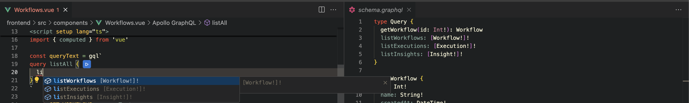
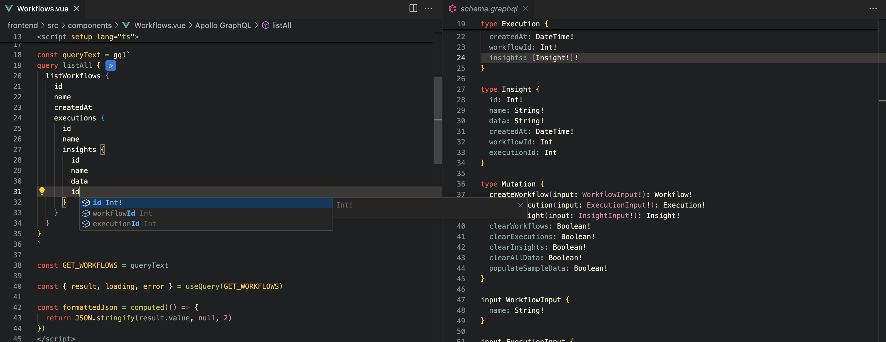

# Local
## Backend

```
cd backend
python3 -m venv .venv
source .venv/bin/activate 
pip install 'strawberry-graphql[fastapi]' asyncpg sqlalchemy databases uvicorn
docker run --name postgres -e POSTGRES_USER=user -e POSTGRES_PASSWORD=pass -e POSTGRES_DB=graphql_db -p 5432:5432 -d postgres
docker exec -it postgres bash
python app.py
```
navigate to http://localhost:8000/graphql

Setup mock data via mutation
```graphql
mutation {
  # dropAllTables # optional
  createAllTables
  populateSampleData
}
```
Run any query
```graphql
query MyQuery {
  listWorkflows {
    id
    name
  }
}
>> {
  "data": {
    "listWorkflows": [
      {
        "id": 1,
        "name": "Boring WF",
      }
    ]
  }
}
```


## Frontend
```
npm create vite@latest frontend --template vue  # vue typescript
cd frontend
npm install @apollo/client graphql @vue/apollo-composable
npm run dev
```


## IDE integration
For frontent checkout https://www.apollographql.com/docs/ide-support/vs-code or open https://open-vsx.org/extension/apollographql/vscode-apollo

Example IDE linked to schema via frontend/apollo.config.json
```json
{
    "client": {
      "service": {
        "name": "my-graphql-app",
        "url": "http://localhost:8000/graphql"
      }
    }
}
```
which provides schema introspection - front enders can work with whatever is available, e.g.
- build queries 
- inspect fields 

## Examples
#### list all workflows
```graphql
query MyQuery {
  listWorkflows {
    id
    name
  }
}
>> {
  "data": {
    "listWorkflows": [
      {
        "id": 1,
        "name": "Boring WF",
      }
    ]
  }
}
```
#### how many models does this workflow have
```graphql
query MyQuery {
  listWorkflows {
    id
    name
    modelCount
  }
}
>> {
  "data": {
    "listWorkflows": [
      {
        "id": 1,
        "name": "Boring WF",
        "modelCount": 2
      }
    ]
  }
}
```
#### List the models this workflow made
```graphql
query MyQuery {
  listWorkflows {
    id
    name
    modelCount
    models {
      name
      modelVersion
    }
  }
}
>> {
  "data": {
    "listWorkflows": [
      {
        "id": 1,
        "name": "Boring WF",
        "modelCount": 2,
        "models": [
          {
            "name": "TinyModel",
            "modelVersion": "v1.2"
          },
          {
            "name": "TinyModel",
            "modelVersion": "v2.2"
          }
        ]
      }
    ]
  }
}
```
#### Ah never mind I mean I want to know for every workflow, for every execution which model, it made
```graphql
query MyQuery {
  listWorkflows {
    id
    name
    modelCount
    executions {
      id
      modelCount
      models {
        name
        modelVersion
      }
    }
  }
}
>> {
  "data": {
    "listWorkflows": [
      {
        "id": 1,
        "name": "Boring WF",
        "modelCount": 2,
        "executions": [
          {
            "id": 1,
            "modelCount": 2,
            "models": [
              {
                "name": "TinyModel",
                "modelVersion": "v1.2"
              },
              {
                "name": "TinyModel",
                "modelVersion": "v2.2"
              }
            ]
          },
          {
            "id": 2,
            "modelCount": 0,
            "models": []
          }
        ]
      }
    ]
  }
}
```
#### For model v1.2, what execution did it come from and what workflow did it come from?
```graphql
query MyQuery {
  listModels (modelVersion:"v1.2") {  # filter
    name
    modelVersion
    executionId  # direct access to relating field
    execution {  # merged details, all execution fields available, including models themselves
      id
      workflowId
    }
    workflow {  # merged details via execution id, all details of workflow available, including executions, models, etc
      id
    }
  }
}
>> {
  "data": {
    "listModels": [
      {
        "name": "TinyModel",
        "modelVersion": "v2.2",
        "executionId": 1,
        "execution": {
          "id": 1,
          "workflowId": 1
        },
        "workflow": {
          "id": 1
        }
      },
      {
        "name": "TinyModel",
        "modelVersion": "v1.2",
        "executionId": 1,
        "execution": {
          "id": 1,
          "workflowId": 1
        },
        "workflow": {
          "id": 1
        }
      }
    ]
  }
}
```